# Cluster-Ising Chain (CIM) Exact Solution

## Source

This note is a structured digest of the source paper for the cluster-Ising model (CIM),
kept here as a reusable reference for writing model-theory notes.

- **Title:** Statistical mechanics of the cluster Ising model
- **Authors:** P. Smacchia, L. Amico, P. Facchi, R. Fazio, G. Florio, S. Pascazio, V. Vedral
- **Reference:** Phys. Rev. A **84**, 022304 (2011)
- **Preprint:** arXiv:1105.0853v2 \[quant-ph\] (7 Jul 2011)
- **Theory anchor for:** [`Projects/Cluster_Ising/`](../../../Projects/Cluster_Ising/README.md), which reproduces
  the paper's numerical claims.
- **Figures:** the plots below (`figures/cluster-ising/figNN_*.png`) are extracted from the source PDF
  and keep the paper's original figure numbers, for reference only.

This digest keeps the paper's own notation (control parameter $\lambda$, Pauli matrices $\sigma^\alpha$,
$N$ sites) so its equation and section numbers can be cited directly. The CIM is **not** a limit of the
generalized two-spin family in [`../model-hamiltonian.md`](../model-hamiltonian.md): it carries a
three-spin cluster interaction. It is recorded here as a separate exactly-solvable 1D chain that reuses the
same [Jordan-Wigner](method/jordan-wigner.md) and [Bogoliubov](method/bogoliubov-diagonalization.md)
machinery as the [TFIM note](tfim-chain.md). Derivation steps below are expanded beyond the paper where it
helps a reader reconstruct the result; nothing from the paper's logic is dropped.

## At a Glance

| Quantity | Result | Where (paper) |
|---|---|---|
| Phases | cluster phase $\lambda<1$ (string order) vs antiferromagnetic phase $\lambda>1$ (staggered mag.) | Sec. II, Fig. 1 |
| QPT | continuous, at $\lambda=1$ (self-dual point), critical indices $z=\nu=1$, $\beta=3/8$, $\alpha=0$ | Table I, Eq. (12) |
| String order | $O_z=(1-\lambda^2)^{3/4}$ for $\lambda<1$, else $0$ | Eq. (51) |
| Staggered mag. | $m_y=\pm(1-\lambda^{-2})^{3/8}$ for $\lambda>1$, else $0$ | Eq. (45) |
| Free energy | identical to a transverse-field Ising chain | Eqs. (8)-(11) |
| Correlation selection rule | $D(r,T)\neq0\iff r=3m+1$; hence $m_z\equiv0$, $R^z_r\equiv0$, $R^x_r\neq0$ only for $r=3m$ | Eq. (33) |
| Two-spin entanglement | concurrence $C(r)=0$ for all $r$, all $\lambda$, all $T$ (cannot detect the QPT) | Eqs. (67), (68) |
| Residual (multipartite) entanglement | $\tau=1$ in cluster phase; $\tau=1-(1-\lambda^{-2})^{3/4}$ for $\lambda>1$ | Eq. (73) |
| Central charge | $c=\bar c=3/2$; CIM criticality = three decoupled Ising chains | Eqs. (78), (80)-(83) |
| Universality | different from transverse-field Ising ($c=1/2$); emergent $E_8\times E_8\times E_8$ | Sec. VIII |

## Definition

The cluster-Ising Hamiltonian on $N$ spins with periodic boundary conditions ($\sigma^\alpha_{N+k}=\sigma^\alpha_k$)
is, **Eq. (1)**:

$$
H(\lambda)=-\sum_{j=1}^N \sigma^x_{j-1}\sigma^z_j\sigma^x_{j+1}
+\lambda\sum_{j=1}^N \sigma^y_j\sigma^y_{j+1}.
$$

A three-spin cluster (ring-exchange) interaction competes with a two-spin antiferromagnetic Ising-like
$\sigma^y\sigma^y$ exchange, tuned by $\lambda\ge0$. All spin components participate; nearest- and
next-to-nearest-neighbor terms involve orthogonal spin orientations.

- **$\lambda=0$ (cluster limit):** the ground state is the cluster state $|C\rangle$, the unique common
  $+1$ eigenstate of the commuting stabilizers $K_j=\sigma^x_{j-1}\sigma^z_j\sigma^x_{j+1}$. It realizes
  symmetry-protected topological order (SPTO) under a $Z_2\times Z_2$ symmetry. The cluster state is the
  resource state of one-way (measurement-based) quantum computation.
- **$\lambda\to\infty$ (Ising limit):** antiferromagnetic order along $y$ with a $Z_2$ symmetry.

| | Cluster state @ $\lambda=0$ | QPT @ $\lambda=1$ | Ising state @ $\lambda=\infty$ |
|---|---|---|---|
| Order | SPTO by $Z_2\times Z_2$ | $c=3/2$, $\nu=z=1$, $\beta=3/8$ | $Z_2$ symmetry |

*(Table I)*

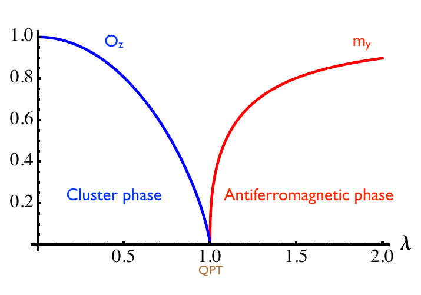

*FIG. 1 (paper). $O_z\neq0$ in the cluster phase $\lambda<1$ (topological/hidden order); $m_y\neq0$ in the
antiferromagnetic phase $\lambda>1$. They mark the two distinct phases meeting at the QPT $\lambda=1$.*

### Physical Realization (Sec. I)

The model sits at the cross-fertilization of quantum information and statistical mechanics. The reference
system is cold atoms in a **triangular optical lattice**; for a suitable parameter choice this is a spin
system with a specific ring-exchange interaction that can be recast into a **"zig-zag chain"**, whose ground
state is the **cluster state** — the resource state of one-way (measurement-based) quantum computation,
reconstructed by suitable single-spin measurements. Besides the three-spin ring-exchange, two-spin
interactions emerge, so the cluster interaction **competes with the exchange** through a control parameter:
the cluster correlation pattern is robust up to a critical value (defining the *cluster phase*), beyond which
the system is in an *Ising phase*, the two separated by a continuous QPT. The cluster phase is marked by a
**diverging range of localizable entanglement**, traceable to a non-vanishing string order parameter. The
CIM of Eq. (1) is a slight variation of that model; its nearest- and next-to-nearest-neighbor exchanges (in
the two- and three-spin terms) involve *orthogonal* spin orientations, so all spin components participate.

## Exact Solution (Sec. III)

### Jordan-Wigner

Invert the string transformation **Eq. (2)** ($c_j=\big(\prod_{m=1}^{j-1}\sigma^z_m\big)\sigma^-_j$,
$\sigma^\pm_j=(\sigma^x_j\pm i\sigma^y_j)/2$) to write the spins as fermions. With the string
$S_j=\prod_{m<j}\sigma^z_m=\prod_{m<j}(1-2n_m)$ and $n_m=c_m^\dagger c_m$,

$$
\sigma^x_j=S_j\,(c_j^\dagger+c_j),
\qquad
\sigma^y_j=-i\,S_j\,(c_j^\dagger-c_j),
\qquad
\sigma^z_j=1-2n_j .
$$

**Cluster term.** In $\sigma^x_{j-1}\sigma^z_j\sigma^x_{j+1}$ the two strings combine,
$S_{j-1}S_{j+1}=S_{j-1}^2\,\sigma^z_{j-1}\sigma^z_j=\sigma^z_{j-1}\sigma^z_j$, and together with the explicit
central $\sigma^z_j=1-2n_j$ they cancel the entire Jordan-Wigner string *interior* to the triple. What
survives is a two-fermion bilinear that couples sites $j-1$ and $j+1$ — a **next-nearest-neighbor
(range-2) hopping-plus-pairing** term. The middle $\sigma^z_j$ is exactly what removes the interior string,
which is why a three-spin operator becomes quadratic in fermions.

**Ising term.** With $S_{j+1}=S_j\sigma^z_j$ and $S_j^2=1$, $\sigma^y_j\sigma^y_{j+1}$ collapses to the
standard **nearest-neighbor (range-1)** hopping-plus-pairing bond of the XY family.

Carrying out the sign bookkeeping (same algebra as [method/jordan-wigner.md](method/jordan-wigner.md)) gives
the quadratic form **Eq. (3)**:

$$
H(\lambda)=\sum_{l=1}^N (c_{l-1}^\dagger-c_{l-1})(c_{l+1}^\dagger+c_{l+1})
+\lambda\sum_{l=1}^N (c_l^\dagger+c_l)(c_{l+1}^\dagger-c_{l+1}),
$$

up to a thermodynamically negligible boundary term. The first (cluster) sum is range-2; the second (Ising)
sum is range-1 — this asymmetry is what later produces the tripled dispersion.

### Fourier + Bogoliubov

Set $q_k=2\pi k/N$ and Fourier transform $b_k=N^{-1/2}\sum_j e^{-iq_k j}c_j$. Equation (3) becomes a sum
of decoupled $(k,-k)$ pairs with a normal part $\propto\epsilon_k$ and an anomalous (pairing) part
$\propto\delta_k$, **Eq. (5)**:

$$
\epsilon_k=\cos 2q_k-\lambda\cos q_k,
\qquad
\delta_k=\sin 2q_k+\lambda\sin q_k,
$$

where the $\cos 2q_k,\sin 2q_k$ pieces come from the range-2 cluster bond and the $\cos q_k,\sin q_k$
pieces from the range-1 Ising bond. A Bogoliubov rotation $b_k=u_k\gamma_k+i v_k\gamma_{-k}^\dagger$ with
amplitudes **Eq. (4)**

$$
u_k=\tfrac{1}{\sqrt2}\sqrt{1+\tfrac{\epsilon_k}{\Lambda_k}},
\qquad
v_k=-\tfrac{1}{\sqrt2}\,\mathrm{sign}(\delta_k)\sqrt{1-\tfrac{\epsilon_k}{\Lambda_k}},
\qquad
\tan 2\theta_k=\frac{\delta_k}{\epsilon_k},
$$

diagonalizes each pair with single-particle energy $2\Lambda_k$, $\Lambda_k=\sqrt{\epsilon_k^2+\delta_k^2}$.
The cross terms collapse via the angle-addition identity:

$$
\epsilon_k^2+\delta_k^2
=1+\lambda^2-2\lambda\big(\cos 2q_k\cos q_k-\sin 2q_k\sin q_k\big)
=1+\lambda^2-2\lambda\cos 3q_k,
$$

so the **dispersion** carries a *tripled momentum*

$$
\Lambda_k=\sqrt{1+\lambda^2-2\lambda\cos\!\Big(\tfrac{6\pi k}{N}\Big)} .
$$

The factor $3q_k$ is the structural fingerprint of the three-spin interaction; it is the seed of both the
central charge $c=3/2$ and the "three decoupled Ising chains" decomposition (Sec. VII). The diagonal form
is **Eq. (6)**:

$$
H(\lambda)=2\sum_{k=1}^N \Lambda_k\Big(\gamma_k^\dagger\gamma_k-\tfrac12\Big),
\qquad \gamma_k|\Omega\rangle=0\ \forall k.
$$

### Free Energy and Ising Equivalence

Because the $\gamma_k$ are independent fermions, the partition function factorizes mode-by-mode:

$$
\mathcal Z(\beta,\lambda)
=\prod_k \mathrm{Tr}\,e^{-2\beta\Lambda_k(n_k-1/2)}
=\prod_k\big(e^{\beta\Lambda_k}+e^{-\beta\Lambda_k}\big)
=\prod_k 2\cosh(\beta\Lambda_k),
$$

which is **Eq. (7)**. Taking $f=-(k_BT/N)\ln\mathcal Z$ in the thermodynamic limit (mode density $N/2\pi$)
gives the free-energy density **Eqs. (8)-(9)**:

$$
f(\beta,\lambda)=-\frac{1}{\pi\beta}\int_0^\pi dp\,\log\!\big[2\cosh(\beta\Lambda(p))\big],
\qquad
\Lambda(p)=\sqrt{1+\lambda^2-2\lambda\cos(3p)}.
$$

The integrand depends on $p$ only through $\cos(3p)$. Rescaling $3p\to p$ (a change of variable that leaves
the integral over a full period invariant) replaces $\cos 3p$ by $\cos p$, i.e. the **Ising dispersion**
$\Lambda^{\mathrm{Ising}}(p)=\sqrt{1+\lambda^2-2\lambda\cos p}$, **Eq. (10)**. Hence the CIM has *exactly the
same free energy* as the transverse-field Ising chain, **Eq. (11)**:

$$
H_{\mathrm{Ising}}(\lambda)=-\sum_{j=1}^N\big(\sigma^x_j\sigma^x_{j+1}+\lambda\sigma^z_j\big).
$$

The second derivative of the (zero-temperature) free energy has the closed form **Eq. (12)**

$$
\partial_\lambda^2 f(\beta,\lambda)\xrightarrow{\beta\to\infty}
\frac{1}{\pi\lambda^2(1+\lambda)}\left[(\lambda+1)^2\,\mathcal E\!\Big(\tfrac{4\lambda}{(1+\lambda)^2}\Big)
-(1+\lambda^2)\,\mathcal K\!\Big(\tfrac{4\lambda}{(1+\lambda)^2}\Big)\right]
\xrightarrow{\lambda\to1}\text{cost}\times\log|\lambda-1|,
$$

with $\mathcal E,\mathcal K$ the complete elliptic integrals of the second and first kind **Eq. (13)**,

$$
\mathcal E(x)=\int_0^{\pi/2}\sqrt{1-x^2\sin^2\theta}\,d\theta,
\qquad
\mathcal K(x)=\int_0^{\pi/2}\frac{d\theta}{\sqrt{1-x^2\sin^2\theta}} .
$$

The divergence as $\lambda\to1$ is the singularity of $\mathcal K(x)$ at $x=1$, which traces back to the
energy gap closing at the critical mode $p=0$, $\lambda=1$; the critical indices are $z=\nu=1$.

### Duality

The Kramers-Wannier-type duality $\mu^z_j=\sigma^x_j\sigma^x_{j+1}$, $\mu^x_j=\prod_{k=1}^j\sigma^z_k$
(**Eq. 14**), whose inverse is $\sigma^z_j=\mu^x_{j-1}\mu^x_j$, maps the Ising interaction into the cluster
one and vice versa, **Eqs. (15)-(16)**:

$$
H_{\mathrm{Ising}}^{\mathrm{dual}}(\lambda)=\lambda H_{\mathrm{Ising}}(\lambda^{-1}),
\qquad
H^{\mathrm{dual}}(\lambda)=\lambda H(\lambda^{-1}).
$$

The QPT $\lambda=1$ is the **self-dual point**. The duality is also the computational lever for the string
order parameter below: it trades the (hard) string operator for the (easy) staggered magnetization.

### Majorana Form

Introduce Majorana operators **Eq. (17)**

$$
\check a_{2j-1}=c_j^\dagger+c_j,
\qquad
\check a_{2j}=i(c_j-c_j^\dagger),
\qquad \{\check a_k,\check a_l\}=2\delta_{kl}.
$$

Inverting, $c_j^\dagger+c_j=\check a_{2j-1}$ and $c_j^\dagger-c_j=i\check a_{2j}$. Substituting into the two
bonds of Eq. (3),

$$
(c_{l-1}^\dagger-c_{l-1})(c_{l+1}^\dagger+c_{l+1})=i\,\check a_{2l-2}\check a_{2l+1},
\qquad
(c_l^\dagger+c_l)(c_{l+1}^\dagger-c_{l+1})=i\,\check a_{2l-1}\check a_{2l+2},
$$

so the Hamiltonian is **Eq. (19)**

$$
H(\lambda)=i\sum_{l=1}^N\check a_{2l-2}\check a_{2l+1}
+i\lambda\sum_{l=1}^N\check a_{2l-1}\check a_{2l+2}.
$$

In an **open chain**, turning off the Ising term ($\lambda=0$) leaves four free (uncoupled) Majoranas
$\check a_1,\check a_3,\check a_{N-2},\check a_N$ (**Eq. 20**). These four zero modes are the origin of the
fourfold ground-state degeneracy and the nontrivial $Z_2\times Z_2$ SPTO of the cluster phase.

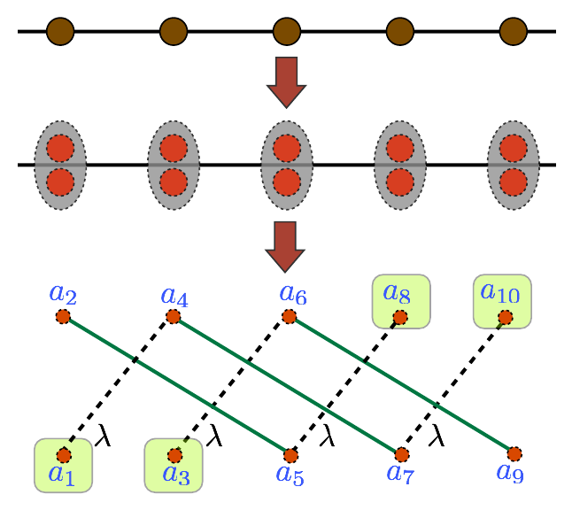

*FIG. 3 (paper). Each fermion (top) splits into a Majorana pair (center). Dashed black lines are the Ising
($\lambda$) couplings; solid green lines are the cluster couplings. The boxed Majoranas are the free modes
responsible for the cluster-state ground-state degeneracy.*

## Correlation Functions (Sec. IV)

Spin correlators at temperature $T$ are $R^\alpha_{jl}(T)=\langle\sigma^\alpha_j\sigma^\alpha_l\rangle_T$
(**Eq. 21**). Each $\sigma^x$ string telescopes into a product of the operators $A_j=c_j^\dagger+c_j$,
$B_j=c_j-c_j^\dagger$ (**Eqs. 22-23**), e.g.
$R^x_{jl}=\langle B_jA_{j+1}B_{j+1}\cdots A_{l-1}B_{l-1}A_l\rangle_T$. Wick's theorem reduces the average to
products of the two-point contractions **Eq. (24)**

$$
\langle A_jA_l\rangle_T=\delta_{jl},
\qquad
\langle B_jB_l\rangle_T=-\delta_{jl},
\qquad
\langle B_jA_l\rangle_T=D(j-l,T)=D(r,T),
$$

and since $\langle A_jA_j\rangle_T,\langle B_jB_j\rangle_T$ vanish in equilibrium the Pfaffians collapse to
**Toeplitz determinants** of the single building block $D(r,T)$, with $r=j-l$ (**Eqs. 26-28**); e.g. $R^x_r$
and $R^y_r$ are $r\times r$ Toeplitz determinants, and $R^z_r=D(0,T)^2-D(r,T)D(-r,T)$ (**Eq. 28**). The
building block is **Eq. (25)**:

$$
D(r,T)=\frac1\pi\int_0^\pi dp\,\frac{\tanh(\beta\Lambda(p))}{\Lambda(p)}
\big\{\cos[(r+2)p]-\lambda\cos[(r-1)p]\big\}.
$$

### Triplet Selection Rule (Eq. 33)

Write $D(r,T)=I(r+2)-\lambda I(r-1)$ (**Eq. 30**) with
$I(n)=\tfrac1\pi\int_0^\pi dp\,\cos(np)\,\tfrac{\tanh(\beta\Lambda(p))}{\Lambda(p)}$ (**Eq. 31**). Folding the
integral onto $[0,\pi/3]$ using the $\cos(3p)$ periodicity of the weight gives **Eq. (32)**

$$
I(n)=\frac1\pi\int_0^{\pi/3}dp\,\cos(np)\Big[1+2\cos\!\Big(\tfrac{2\pi n}{3}\Big)\Big]\frac{\tanh(\beta\Lambda(p))}{\Lambda(p)}.
$$

The prefactor $1+2\cos(2\pi n/3)$ equals $3$ when $3\mid n$ and $0$ otherwise (for $n\equiv1,2$,
$\cos(2\pi n/3)=-\tfrac12$). Hence $I(n)\neq0\iff 3\mid n$. Since $(r+2)$ and $(r-1)$ differ by $3$ they are
congruent mod $3$, so both terms switch on together, giving **Eq. (33)**:

$$
D(r,T)\neq0 \iff r=3m+1,\quad m\in\mathbb Z.
$$

**Consequences.** Because $0\neq 3m+1$, the block $D(0,T)$ vanishes, so the **$z$-magnetization is
identically zero**, $m_z(T)=\langle\sigma^z_j\rangle_T=-D(0,T)\equiv0$ (**Eq. 29**), and likewise
$R^z_r=D(0)^2-D(r)D(-r)\equiv0$ (no $r$ makes both $r$ and $-r$ equal to $3m+1$). The physical
$x$-correlator $R^x_r$ (a Toeplitz determinant of these $D$'s) is **nonvanishing only when $r$ is a multiple
of $3$**, decreasing with distance; the $y$-correlator $R^y_r$ is always nonvanishing and negative for odd
$r$ (the antiferromagnetic direction). This pattern — $m_z\equiv0$, $R^x$ alive only on the triplet
sublattice, $R^y$ always alive — is the fingerprint distinguishing CIM from a plain Ising chain.

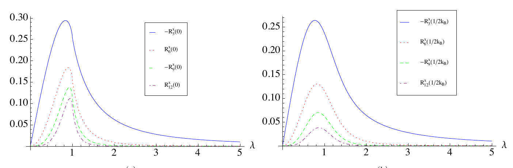

*FIG. 4 (paper). $|R^x_r|$ for $r=3,6,9,12$: (a) $T=0$, (b) $T=1/2k_B$. Nonzero only on multiples of $3$,
peaked near $\lambda=1$, decaying with $r$.*

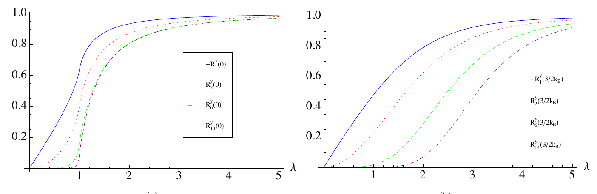

*FIG. 5 (paper). $|R^y_r|$ for $r=1,2,6,14$: (a) $T=0$, (b) $T=3/2k_B$. Always nonzero; sharper rise toward
unity for larger $r$ as the antiferromagnetic order sets in.*

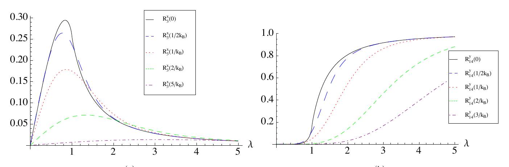

*FIG. 6 (paper). Temperature dependence at fixed distance: (a) $R^x_3(T)$, (b) $R^y_{14}(T)$. Higher $T$
softens and lowers the transition.*

### Order Parameters

- **$z$-magnetization (Eq. 29):** $m_z(T)=-D(0,T)\equiv0$ for all $\lambda,T$ (selection rule above).
- **Staggered magnetization (Ising order).** Because the $Z_2$ symmetry forces
  $\langle(-1)^j\sigma^y_j\rangle=0$, it is extracted from the large-distance Toeplitz asymptotics,
  $\lim_{r\to\infty}(-1)^r R^y_r(0)=m_y^2$ (**Eq. 34**). Since $R^y_r$ is a Toeplitz determinant
  $\det A_n$ with symbol $f(p)$ (i.e. $a_m=\tfrac{1}{2\pi}\int_{-\pi}^\pi e^{-imp}f(p)\,dp$), **Szegő's
  theorem** fixes its $n\to\infty$ limit, **Eq. (35):**

$$
\lim_{n\to\infty}\frac{\det A_n}{\mu^n}=\exp\!\Big(\sum_{n=1}^\infty n\,g_ng_{-n}\Big),
\quad
\log\mu=\frac{1}{2\pi}\int_{-\pi}^\pi\log f(p)\,dp,
\quad
g_n=\frac{1}{2\pi}\int_{-\pi}^\pi e^{-inp}\log f(p)\,dp.
$$

  Here the symbol is $c(p)$ with $D(r,0)=-\tfrac{1}{2\pi}\int_{-\pi}^\pi e^{-irp}e^{ip}\sqrt{\tfrac{\lambda-e^{-3ip}}{\lambda-e^{3ip}}}\,dp$
  (**Eqs. 36-37**), so $\tilde c(p)=-\sqrt{(\lambda-e^{-3ip})/(\lambda-e^{3ip})}$. The phase integral gives
  $\log\mu=i\pi\Rightarrow\mu=-1$ (the second integral is odd, hence zero), **Eq. (38)**. For $\lambda>1$,
  with $\alpha=1/\lambda$, $\log\tilde c(p)=i\pi+i\sum_{l\ge1}\tfrac{\alpha^l}{l}\sin(3lp)$ (**Eq. 40**), so
  only multiples of $3$ survive the $\sin(np)\sin(3lp)$ integral, **Eqs. (41)-(42):**

$$
g_n=\begin{cases}\dfrac{3}{2n}\alpha^{n/3}, & n\in\{3,6,9,\ldots\},\\[2pt]0,&\text{otherwise},\end{cases}
\qquad g_{-n}=-g_n,
$$

  and the exponent sums to $\sum_n n\,g_ng_{-n}=-\tfrac94\sum_{n\in B}\tfrac{\alpha^{2n/3}}{n}=-\tfrac34\log(1-\alpha^2)$
  (**Eq. 43**), while for $\lambda<1$ it diverges to $-\infty$ (**Eq. 44**). Substituting into Eq. (35) gives
  **Eq. (45):**

$$
m_y=\pm\lim_{r\to\infty}\sqrt{(-1)^r R^y_r(0)}
=\begin{cases}\pm(1-\lambda^{-2})^{3/8}, & \lambda>1,\\ 0, & \lambda<1.\end{cases}
$$

  It is a *nonlocal* order parameter for the antiferromagnetic phase.

- **String order parameter (hidden order of the cluster phase).** Defined by **Eq. (46)**

$$
O_z=\lim_{N\to\infty}(-1)^N\Big\langle\sigma^x_1\sigma^y_2\Big(\prod_{k=3}^{N-2}\sigma^z_k\Big)\sigma^y_{N-1}\sigma^x_N\Big\rangle .
$$

  The duality of Sec. III C turns this into a *dual* magnetization. The dual variable
  $\mu^y_j=-i\mu^z_j\mu^x_j=-\big(\prod_{k=1}^{j-1}\sigma^z_k\big)\sigma^y_j\sigma^x_{j+1}$ (**Eq. 47**) builds a
  two-point function whose string is precisely the operator in Eq. (46), **Eqs. (48)-(49):**

$$
\mu^y_j\mu^y_l=\sigma^x_j\sigma^y_{j+1}\Big(\prod_{k=j+2}^{l-1}\sigma^z_k\Big)\sigma^y_l\sigma^x_{l+1}
\ \xrightarrow{j=1,\,l=N-1}\ \sigma^x_1\sigma^y_2\Big(\prod_{k=3}^{N-2}\sigma^z_k\Big)\sigma^y_{N-1}\sigma^x_N .
$$

  Hence by Szegő's theorem $O_z=\lim_{N\to\infty}(-1)^N\langle\mu^y_1\mu^y_{N-1}\rangle_0=m_{y,\text{dual}}^2$
  (**Eq. 50**), and the duality $H^{\mathrm{dual}}(\lambda)=\lambda H(\lambda^{-1})$ (Eq. 16) lets
  $m_{y,\text{dual}}^2$ be read off from Eq. (45) with $\lambda\to\lambda^{-1}$, giving **Eq. (51):**

$$
O_z=m_{y,\text{dual}}^2=\begin{cases}(1-\lambda^2)^{3/4}, & \lambda<1,\\ 0, & \lambda>1.\end{cases}
$$

Near criticality $O_z\sim(1-\lambda)^{3/4}$ and $m_y\sim(\lambda-1)^{3/8}$ — the exponent $\beta=3/8$ is
**not** the Ising value $1/8$, confirming a different universality class. Both curves appear in Fig. 1.

### Finite-Size Correlations (Sec. IV C)

At finite $N$ (ED on $N=4,6,8,10,12$) the multiple-of-3 selection rule is only exact in the thermodynamic
limit: "spurious" $x$-correlations and $z$-magnetization survive except when $N$ itself is a multiple of $3$
(e.g. $N=6$), and their maxima fall off as $\sim0.97\times N^{-0.88}$, vanishing as $N\to\infty$.

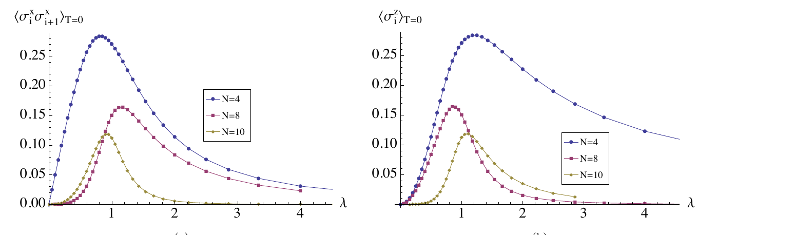

*FIG. 7 (paper). $N=4,8,10$: (a) first-neighbor $\langle\sigma^x_i\sigma^x_{i+1}\rangle_{T=0}$,
(b) zero-temperature $\langle\sigma^z_i\rangle$. Both shrink toward the thermodynamic-limit zero as $N$ grows.*

### Majorana Correlation Matrix (Sec. IV D)

Ground-state Majorana two-point functions assemble into the antisymmetric matrix
$\langle\check a_j\check a_l\rangle_0=\delta_{jl}+i(\Gamma_N)_{jl}$ (**Eq. 53**), block-Toeplitz with
$2\times2$ blocks (**Eqs. 54-55**)

$$
\Pi_j=\begin{pmatrix}0 & D(j,0)\\ -D(-j,0) & 0\end{pmatrix}.
$$

This $\Gamma_N$ is the single object feeding the reduced density matrices (Sec. V) and the block entropy
(Sec. VII): every ground-state observable is a Gaussian contraction of it.

## Entanglement (Secs. V-VII)

### Reduced Density Operators (Sec. V)

A reduced density matrix is obtained by partial tracing the chain state $\rho=\sum_w p_w|\Omega_w\rangle\langle\Omega_w|$
over the complementary spins (**Eq. 56**). For a block of the first $L$ contiguous spins, translational
invariance lets one expand it in Pauli strings, **Eqs. (57)-(58):**

$$
\rho_{\{L\}}=2^{-L}\!\!\sum_{\alpha_1,\ldots,\alpha_L\in\{0,x,y,z\}}\!\!p_{\alpha_1\ldots\alpha_L}\,
\sigma^{\alpha_1}_1\cdots\sigma^{\alpha_L}_L,
\qquad
p_{\alpha_1\ldots\alpha_L}=\langle\sigma^{\alpha_1}_1\cdots\sigma^{\alpha_L}_L\rangle .
$$

Parity invariance forces a coefficient to vanish unless the number of $\sigma^x$ *and* of $\sigma^y$ are both
even; the surviving ones follow by Wick's theorem from $\Gamma_N$. The single-spin (**Eq. 59**) and
two-spin (**Eq. 60**) cases specialize to

$$
\rho_j=\frac12\sum_{\alpha\in\{0,x,y,z\}}p_\alpha\,\sigma^\alpha_j,
\qquad
\rho_{jl}=\frac14\sum_{\alpha,\beta\in\{0,x,y,z\}}p_{\alpha\beta}\,\sigma^\alpha_j\otimes\sigma^\beta_l,
$$

with $p_\alpha=\langle\sigma^\alpha_j\rangle$ and $p_{\alpha\beta}=\langle\sigma^\alpha_j\sigma^\beta_l\rangle$,
making manifest that the two-spin state is fixed entirely by the correlation functions of Sec. IV.

### Two-Spin Entanglement (Sec. VI)

Use the concurrence $C(r)=\max\{\sqrt{\gamma_1}-\sqrt{\gamma_2}-\sqrt{\gamma_3}-\sqrt{\gamma_4},0\}$
(**Eq. 61**, $\gamma_1\ge\gamma_2\ge\gamma_3\ge\gamma_4$ the eigenvalues of
$\mathcal R_r=\rho_{1,r+1}\tilde\rho_{1,r+1}$, $\tilde\rho=(\sigma^y\!\otimes\sigma^y)\rho^*(\sigma^y\!\otimes\sigma^y)$),
which is a **convex** functional, $C(\sum_i p_i\rho_i)\le\sum_i p_iC(\rho_i)$ (**Eq. 62**), and the residual
entanglement / tangle $\tau=4\det\rho_1-\sum_r C^2(r)$ (**Eq. 63**, a global measure of multipartite
entanglement).

The four eigenvalues are built from the correlators (**Eq. 65**):

$$
\gamma_{1,3}=\tfrac{1}{16}\big(1\pm R^x_r(0)+R^y_r(0)\big)^2,
\qquad
\gamma_{2,4}=\tfrac{1}{16}\big(1\pm R^x_r(0)-R^y_r(0)\big)^2 .
$$

When $r$ is **not** a multiple of $3$, $R^x_r=0$ makes them pairwise equal ($\gamma_1=\gamma_3$,
$\gamma_2=\gamma_4$, **Eq. 66**), so $C(r)=0$; when $r=3m$ the four differ but the combination of square
roots stays $\le0$, so $C(r)=0$ there too (Fig. 8).

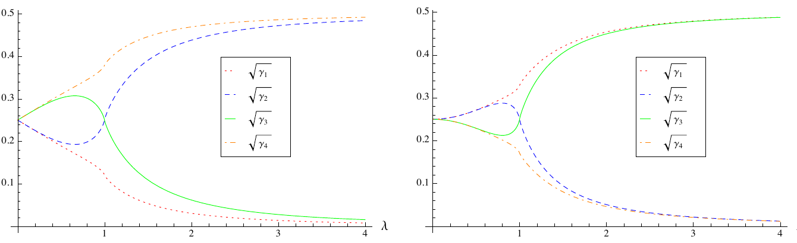

*FIG. 8 (paper). $\sqrt{\gamma_i}$ vs $\lambda$ for (a) $r=3$ and (b) $r=6$; the concurrence combination
never turns positive.*

- In the **"thermal" (symmetric, parity-degenerate) ground state**
  $\rho_0=\tfrac12(|\Omega_1\rangle\langle\Omega_1|+|\Omega_2\rangle\langle\Omega_2|)$ the concurrence
  vanishes for every pair and every $\lambda$, at $T=0$ and at finite $T$ (**Eqs. 67, 68**), while the
  multipartite tangle saturates, $\tau=1$ for all $\lambda$ (**Eq. 69**).
- In the **symmetry-breaking ground state** (small staggered field $h\sum(-1)^j\sigma^y_j$): convexity
  applied to the degenerate $\rho_0=\tfrac12(\rho_1+\rho_2)$ only gives $0=C(\rho_0)\le\tfrac12[C(\rho_1)+C(\rho_2)]=C(\rho_1)$
  (**Eq. 70**), so the broken-symmetry concurrence *could* in principle be nonzero. It is not: the
  symmetric coefficients are unchanged (so $m_z$ stays zero), while $\langle\sigma^x_j\rangle_0^2=\lim_{r\to\infty}R^x_r(0)=0$
  for all $\lambda$ (**Eq. 71**) and the numerics of Fig. 10 confirm the concurrence stays zero. Thus
  two-spin entanglement *still* cannot signal the QPT. The single-spin state reduces to
  $\rho_j=\tfrac12[I_j+(-1)^j m_y\sigma^y_j]$ (**Eq. 72**), and the tangle becomes **Eq. (73):**

$$
\tau=4\det\rho_1=1-m_y^2=\begin{cases}1, & \lambda<1,\\ 1-(1-\lambda^{-2})^{3/4}, & \lambda>1,\end{cases}
$$

  with $\partial_\lambda\tau\sim-\text{cost}\times(\lambda-1)^{-1/4}$ at $\lambda\to1^+$ (**Eq. 74**). The
  multipartite entanglement is maximal and constant throughout the cluster phase and decreases in the Ising
  phase, so it *does* detect the transition.

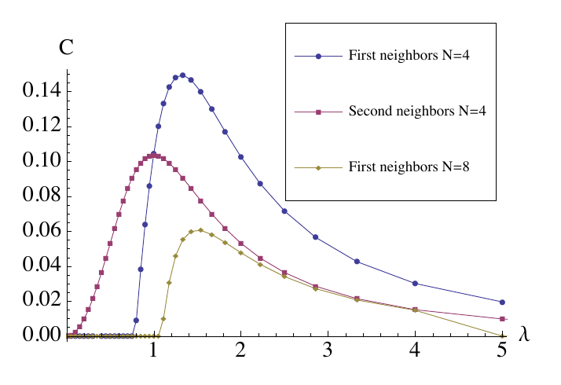

*FIG. 9 (paper). The only non-vanishing finite-size concurrences (first/second neighbors, $N=4,8$); they
shrink with system size toward the thermodynamic-limit value $C=0$.*

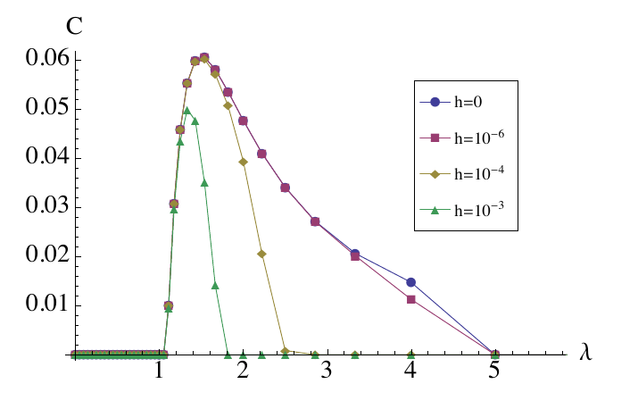

*FIG. 10 (paper). First-neighbor concurrence ($N=8$) for staggered-field strengths $h=0,10^{-6},10^{-4},10^{-3}$;
symmetry breaking does not produce a transition-detecting concurrence.*

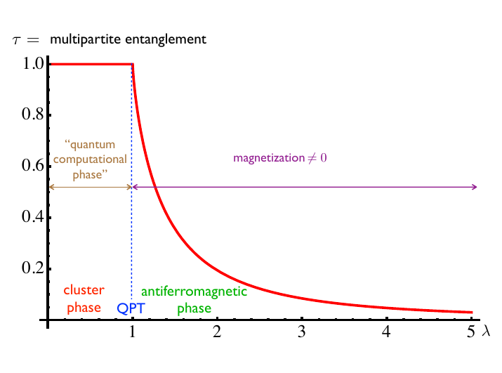

*FIG. 2 (paper). Residual (multipartite) entanglement $\tau$ in the symmetry-breaking ground state: constant
$\tau=1$ in the cluster ("quantum computational") phase, decreasing in the antiferromagnetic phase. Its
first derivative is singular at $\lambda=1$.*

### Block Entropy and Central Charge (Sec. VII)

The von Neumann block entropy is $S_L=\sum_{j=1}^L H\!\big(\tfrac{1+\nu_j}{2}\big)$ with $H$ the Shannon
entropy and $\pm i\nu_j$ the eigenvalues of $\Gamma_L$ (**Eqs. 75-77**). At criticality ($\lambda=1$),
numerically for blocks up to $L=200$ (**Eq. 78**):

$$
S_L\sim\tfrac12\log_2 L+a,\qquad a\simeq1.236,
$$

where the least-squares slope is $0.506\pm0.001$ and $a\simeq1.236\pm0.008$. The constant agrees with the
value obtained from self-dual arguments, **Eq. (79):**

$$
a=\frac{1+\gamma_E+(2-6I_3)\ln2-\ln3}{2\ln2}\simeq1.246,
$$

with $\gamma_E\simeq0.577$ the Euler-Mascheroni constant and $I_3\simeq0.022$ a further constant. This
matches the CFT scaling $S_L\sim\tfrac{c+\bar c}{6}\log_2 L$ (**Eq. 80**) with

$$
\boxed{c=\bar c=\tfrac32.}
$$

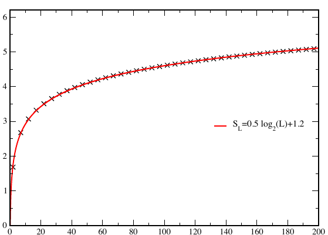

*FIG. 11 (paper). Critical block entropy $S_L$ (crosses) and the fit $S_L\simeq0.5\log_2 L+1.2$, confirming
the prefactor $1/2$ and hence $c=3/2$.*

This is confirmed analytically by recasting the CIM at criticality as **three decoupled Ising chains**:
taking $N=3M$ and splitting the mode sum of Eq. (6) into three sectors $s=1,2,3$ via
$\gamma_k^{(s)}=\gamma_{k+(s-1)M}$, **Eqs. (81)-(83):**

$$
H(\lambda)=\sum_{s=1}^3 H^{(s)}_{\mathrm{Ising}},
\qquad
H^{(s)}_{\mathrm{Ising}}=2\sum_{k=1}^M\Lambda^{\mathrm{Ising}}_k\Big(\gamma_k^{(s)\dagger}\gamma_k^{(s)}-\tfrac12\Big),
\qquad
\Lambda^{\mathrm{Ising}}_k=\sqrt{1+\lambda^2-2\lambda\cos\!\big(\tfrac{2\pi k}{M}\big)} .
$$

Since the central charge is extensive, $c=3\times\tfrac12=\tfrac32$ as a sum of three Ising central charges
— the macroscopic counterpart of the tripled dispersion $\cos(3q)$ found in the diagonalization.

## Conclusions (Sec. VIII)

- The QPT at $\lambda=1$ is exotic: the two phases enjoy distinct symmetries that cannot be continuously
  joined; the cluster phase admits **no local order parameter**.
- Most of the physics lives beyond two-spin correlations (multipartite entanglement).
- The CIM universality class differs from the transverse-field Ising one ($c=1/2$); the criticality is
  characterized by an emergent $E_8\times E_8\times E_8$ symmetry. Comparison with triplet-interaction spin
  models relates it to four-state ($c=1$) and three-state ($c=4/5$) Potts criticality only when external
  fields are switched on.

## Bridge to Repo Method Notes

- The free-fermion reduction reuses [method/jordan-wigner.md](method/jordan-wigner.md); the pairing
  diagonalization reuses [method/bogoliubov-diagonalization.md](method/bogoliubov-diagonalization.md),
  exactly as in [tfim-chain.md](tfim-chain.md).
- Gaussian-state contractions (Majorana covariance $\Gamma$, Pfaffian/Toeplitz correlators, block-entropy
  from $\nu_j$) parallel the "Correlators" and "Entanglement Entropy" recipes in [tfim-chain.md](tfim-chain.md).
- Symbol map to the paper: $\lambda$ is the cluster-vs-Ising control parameter (not an anisotropy);
  $\sigma^\alpha$ are Pauli matrices (not the repo's $S^\alpha=\sigma^\alpha/2$); $N$ is the site count;
  $q_k=2\pi k/N$ is the lattice momentum.

## References

- P. Smacchia, L. Amico, P. Facchi, R. Fazio, G. Florio, S. Pascazio, V. Vedral,
  "Statistical mechanics of the cluster Ising model", Phys. Rev. A **84**, 022304 (2011), arXiv:1105.0853.
- W. Son, L. Amico, R. Fazio, A. Hamma, S. Pascazio, V. Vedral, arXiv:1103.0251 — companion cluster-Ising
  study (the CIM is introduced there as ref. [16]).
- H. J. Briegel and R. Raussendorf, Phys. Rev. Lett. **86**, 910 (2001) — cluster state.
- E. Lieb, T. Schultz, D. Mattis, Annals of Physics **16**, 407 (1961); E. Barouch and B. M. McCoy,
  Phys. Rev. A **3**, 786 (1971) — free-fermion / Toeplitz correlation technique.
- G. Vidal, J. Latorre, E. Rico, A. Kitaev, Phys. Rev. Lett. **90**, 227902 (2003) — entanglement-entropy
  method used for the block entropy.
- [method/jordan-wigner.md](method/jordan-wigner.md), [method/bogoliubov-diagonalization.md](method/bogoliubov-diagonalization.md)
